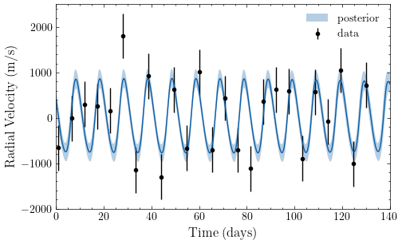
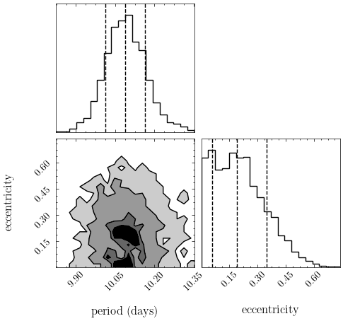
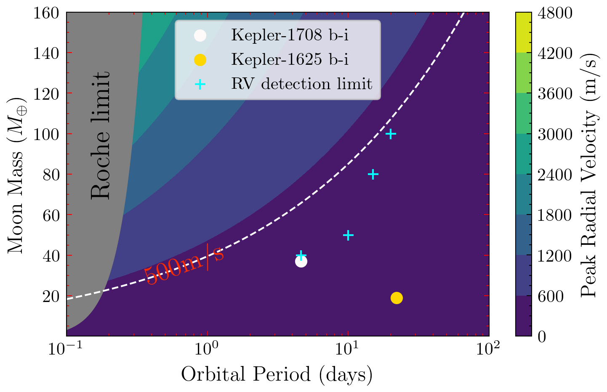
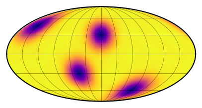
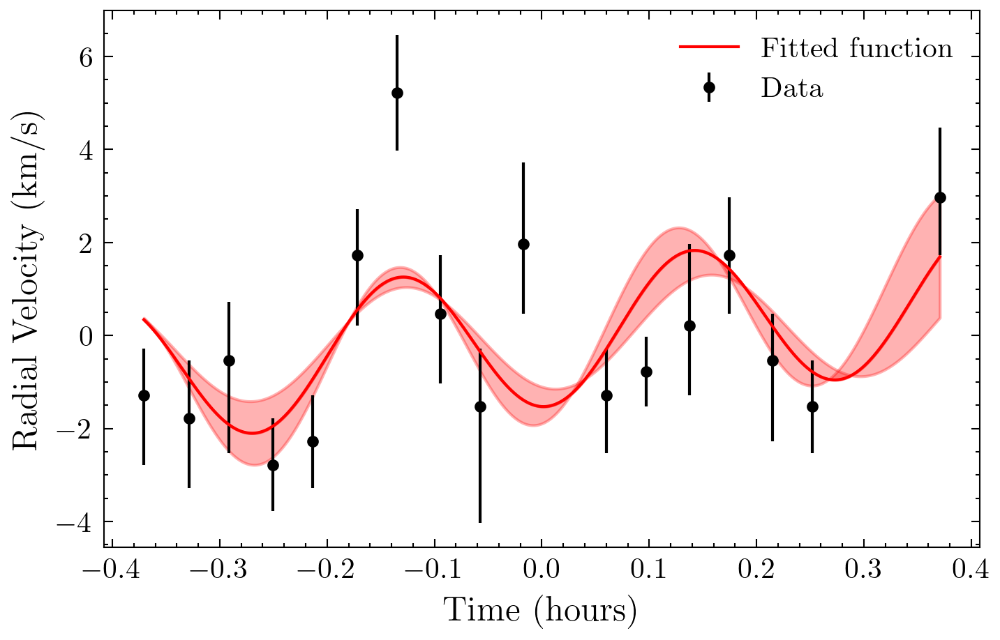
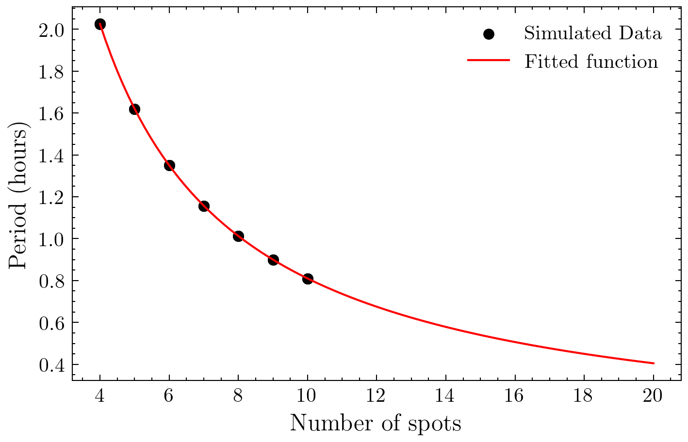

# Finding the best exoplanets to search for exomoons by radial velocity

**First Thesis Project for the Master of Science in Astronomy and Data Science at Leiden University** <br>
The project was completed in the period of February to December 2022.

**Author**: [Ioannis Koutalios](http://koutalios.space/) <br>
**Supervisor**: [Dr. Matthew Kenworthy](https://kenworthy.space/) 

## Introduction

This research delves into the detection of exomoons through radial velocity variations, focusing on the exoplanet β Pictoris b. Exomoons are natural satellites orbiting planets outside our solar system and may provide critical insights into planetary system formation and habitability. The study combines theoretical modeling, simulation, and real observational data to refine detection techniques and explore new frontiers in exoplanetary science.

## Files
The repository contains the following files:
- `constants.py`: Contains the physical constants used in the project.
- `my_plot.py`: Contains custom plotting functions.
- `exoplanets.py`: Python script that creates a plot of the discovered exoplanets from the [exoplanet.eu catalog](http://exoplanet.eu/catalog/).
- `io_beta.py`: Python script to compare the effect of Io on Jupiter's radial velocity signal, with potential exomoons around Beta Pictoris b.
- `spectra.py`: Python script to rebin and convolve the two simulated spectra for Beta Pictoris b.
- `doppler.py`: Python script to inject and detect an artificial doppler shift in the convolved spectra.
- `simulations.py`: Python script to simulate exomoons around Beta Pictoris b and detect them using Bayesian inference on the radial velocity signal.
- `contour.py`: Python script to create a contour plot of the Radial Velocities on a grid of Period and Mass of potential exomoons around Beta Pictoris b. On the plot, we also show the detection limits for our method.
- `rossiter_testing.ipynb`: Jupyter notebook to test the `starry` package for the Rossiter-McLaughlin effect.
- `rossiter.py`: Python script to analyze the real radial velocity data of Beta Pictoris b for the Rossiter-McLaughlin effect.
- `spots.py`: Python script to test the effect of spots on the surface of a star on the radial velocity signal, with the Rossiter-McLaughlin effect.
- `zones.py`: Python script to test the effect of potential zones on the surface of a planet on the radial velocity signal. The script was not used in the final project.
- `exoplanet_catalog/`: Directory containing the exoplanet catalog data.
- `spectral_data/`: Directory containing two simulated spectra for Beta Pictoris b.
- `rv_data/`: Directory containing real radial velocity data for Beta Pictoris b from two observatons.
- `plots_detection/`: Directory containing the plots from the Bayesian inference.
- `plots_rossiter/`: Directory containing the plots from the analysis of the Rossiter-McLaughlin effect.
- `plots/`: Directory containing the rest of the plots from the project.
- `traces/`: Directory containing the traces and their summaries from the Bayesian inference.
- `requirements.txt`: File containing the required packages for the project.
- `environment.yml`: File containing the conda environment for the project.
- `README.md`: This file.

## Requirements

The project was developed using Python 3.9.12. The required packages can be installed using two methods:
- Using `conda` by creating a new environment with the `environment.yml` file (recommended).
- Using `pip` by installing the required packages from the `requirements.txt` file.

For the `conda` method, execute the following command:

```bash
conda env create -f environment.yml
```

This will create a new environment called `exomoons` with the required packages.

For the `pip` method, execute the following command:

```bash
pip install -r requirements.txt
```

This will install the required packages in the current environment. Be careful as this might affect the packages in your current environment, or there might be conflicts with the versions of the packages.

## How to run the code

The code can be run using the following command:

```bash
python <script_name>.py
```

where `<script_name>` is the name of the Python script you want to run. The scripts are standalone and do not require any input arguments. The scripts are designed to be run in the they are listed in the `Files` section, however, they can be run in any order as the required data is provided in the directories.

## Results

Here are some of the results from the project. For a detailed description of the results, please visit the [project's page](https://koutalios.space/projects/exomoons/).

 <br>
*Simulated Spectrum for Beta Pictoris b. You can see the orginal, rebinned, and convolved spectra.*

 <br>
*Radial velocity signal for Beta Pictoris b with a simulated exomoon. The blue line represents the posterior*

 <br>
*Corner plot of the posterior distribution for the period and eccentricity of the simulated exomoon*

 <br>
*Contour plot of the Radial Velocities on a grid of Period and Mass of potential exomoons around Beta Pictoris b. With the blue crosses representing the detection limits for our method and the two spots showing the mass and period of two exomoon candidates around other exoplanets as a comparison*

 <br>
*Spot creation using the `starry` package.*

 <br>
*Real radial velocity data for Beta Pictoris b fitted with a sinusoidal function.*

 <br>
*Estimating the number of spots required to account for the periodicity in the radial velocity data.*

## License
This project is licensed under the MIT License. See the [LICENSE](./LICENSE) file for details.

## Acknowledgments

I would like to thank Dr. Matthew Kenworthy for his guidance and support throughout the project.